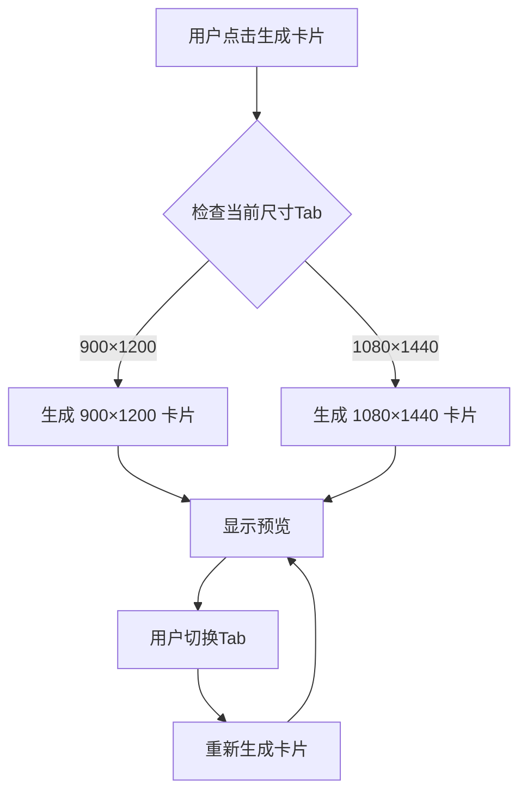

# 卡片尺寸 Tab 切换功能设计

## 概述

在卡片预览区添加尺寸选择 Tab，允许用户切换查看不同尺寸的卡片：
- 默认尺寸：900×1200 像素（现有）
- 新增尺寸：1080×1440 像素（3:4 比例）

## Why

用户需要生成不同尺寸的卡片以适应不同平台或用途。当前系统仅支持固定的 900×1200 尺寸，无法满足多样化的输出需求。

**How to apply:** 添加 Tab 切换功能，让用户可以在预览区快速切换尺寸并重新生成卡片。

## UI 设计

### Tab 位置

预览区顶部，标题「卡片预览」下方。

### Tab 标签

- 「900×1200」（默认选中）
- 「1080×1440」

### 样式规范

与现有的主功能 Tab（卡片生成/iPhone套壳）保持一致的样式：
- 使用 `.main-tabs` 和 `.main-tab-btn` 相似的 CSS 类
- 选中态：底部高亮线条 + 颜色变化
- Hover 态：背景色变化

## 功能逻辑

### 生成逻辑

1. 点击「生成卡片」按钮时，根据当前选中的尺寸 Tab 生成对应尺寸的卡片
2. 切换 Tab 时自动重新生成所有卡片（保持当前设置不变）
3. 下载/复制按钮操作当前显示的图片

### 状态持久化

- Tab 选择保存到 `localStorage.selectedCardSize`
- 默认值：「900×1200」

## 技术实现

### Canvas 尺寸

| Tab | Canvas Width | Canvas Height |
|-----|--------------|---------------|
| 900×1200 | 900 | 1200 |
| 1080×1440 | 1080 | 1440 |

### 修改范围

1. **HTML**：添加预览区尺寸 Tab 结构
2. **CSS**：添加尺寸 Tab 样式（复用现有 Tab 样式）
3. **JavaScript**：
   - 添加 Tab 切换逻辑
   - 修改 `generateCard()` 函数，支持动态 canvas 尺寸
   - 添加 localStorage 保存/恢复逻辑

### 关键函数修改

- `generateCard()` (line 1994)：添加尺寸参数，根据 Tab 选择设置 canvas.width/height
- Tab 切换事件：触发重新生成

## 交互流程

## 兼容性

- 现有功能保持不变
- 默认 Tab 为「900×1200」，不影响现有用户体验